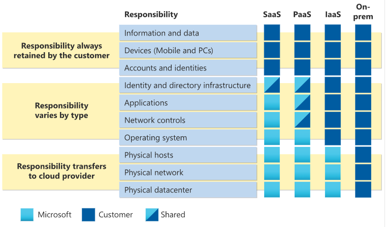

# Cloud Concepts
**Cloud computing** is the delivery of computing services over the internet which includes common IT infrastructure such as:
- virtual machines
- storage
- databases
- networking

Cloud services include things like:
- Internet of Things
- Machine Learning
- Artificial Intelligence

**You** (the consumer) will always be responsible for:
- information and data stored in the cloud
- devices that are allowed to connect to your cloud
- account and identities of the people, services and devices within your organization

**Cloud Provider** will always be responsible for:
- physical data center
- physical network
- physical hosts

## cloud models

**Private cloud** - is a cloud used by a *single entity*. Provides much greater control for the company and its IT department but comes with a greater cost and fewer of the benefits of a public cloud deployment.

**Public cloud** - built, controlled, and maintained by a 3rd-party cloud provider. Anyone that wants to purchase cloud services can access and use resources. 

**Hybrid cloud** - uses both public and private clouds in an inter-connected environment. Can be used ot provide an extra layer of security like users can flexibly choose which services to keep in public cloud and which to deploy to their private cloud infrastructure.

|Public|Private|Hybrid|
|-|-|-|
|No capital expenditures to scale up|Organizations have complete control over resources and security|Provides the most flexibility|
|Apps can be quickly (de)provisioned|Data is not collocated with other organization's data|Organizations determine where to run their applications|
|Organizations pay only for what they use|Hardware must be purchased for startup and maintenance|Organizations control security, compliance, or legal requirements|
|ORganizations don't have complete control over resources and security|Organizations are responsible for hardware maintenance and updates||

**Multicloud** - you use multiple public cloud providers where you deal with two or more public cloud providers and manage resources and security in both environments.

A likely scenario is maybe you use different features from different cloud providers, or you started with one provider and are in the process of migrating.

**Azure Arc** is a set of technologies that helps manage your cloud environment whether it's a public cloud solely on Azure, a private cloud in your datacenter, a hybrid configuration, or even a multi-cloud environment running on multiple cloud providers at once.

**Azure VMWare Solution** - migration service from VMWare in a private cloud environment to a public or hybrid cloud with seamless integration and scalability.

-----
---

There are two types of expenses:
|**CapEx** Capital Expenditure|**OpEx** Operational Expenditure|
|:-:|:-:|
|Typically one-time, up-front expenditure to purchase or secure tangible resource.|Spending money on services or products over time.|
|e.g. Building a data center, new building, parking lot|e.g. Renting, leasing, singing up for cloud services|

**Consumption-based model** - you don't pay for the physical infrastructure, electricity, security, etc.
- No upfront costs.
- No need to purchase and manage costly infrastructure that users might not use to its fullest potential.
- The ability to pay for more resources when they're needed.
- The ability to stop paying for resources that are no longer needed.

Cloud computing is a way to rent compute power and storage from someone else's data center. *You're billed only for what you use.*

