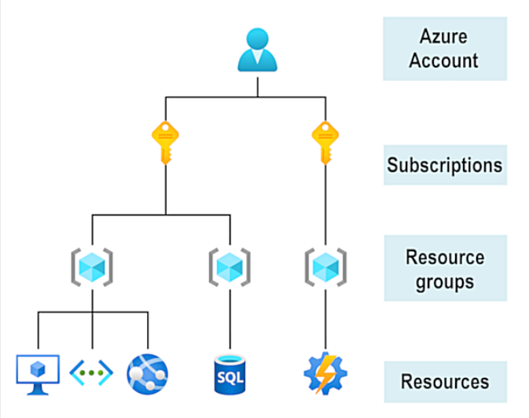
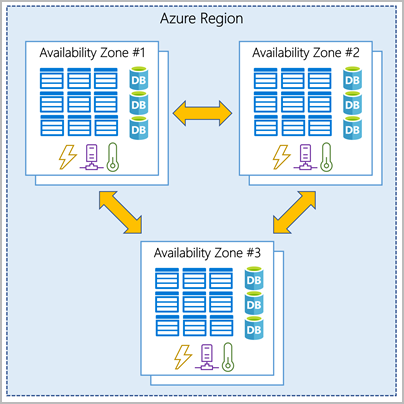
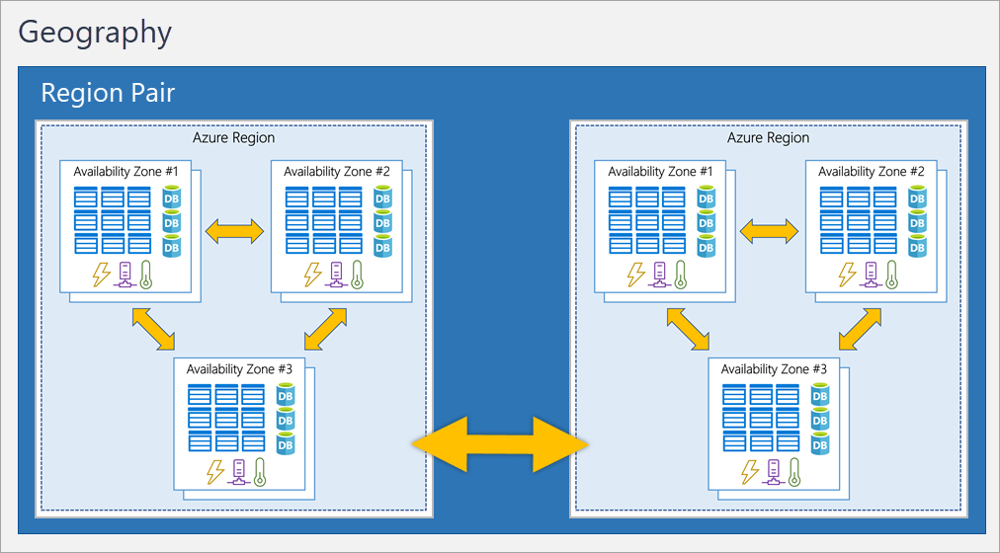
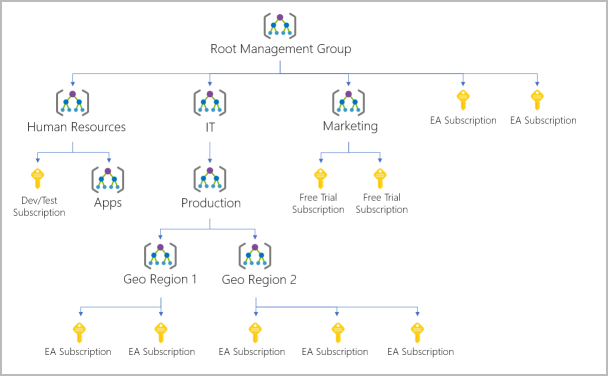

# Azure architecture and services

Azure provides more than 100 services that lets you do everything from running your existing apps on VMs to exploring new software paradigms.

### Getting Started

You need an Azure subscription which needs an Azure account. Afterwards, you can start creating Azure resources within each subscription.

> ### Microsoft Learn Sandbox
> creates a temporary subscription which allows you to create Azure resources during a Learn module.

---

## Physical infrastructure
Starts with **datacenters**.
As a global cloud provider, Azure has datacenters around the world. These are grouped into Azure Regions or Availability Zones.

### **Azure Regions** 
is a geographical area that contains at least one datacenter that are nearby and networked together with low-latency network.

When you deploy a resource in Azure, you'll often need to choose the region where you want your resource deployed.

> Note: Some services or VM features are only available in certain regions such as specific VM size or storage types. 

### **Availability Zones**
 
 are physically separate datacenters within an **`Azure region`**. Each zone is made up of one or more datacenters equipped with independent power, cooling and networking. 

These zones are set up to be an isolation boundary. If one goes down, the other continues working. 

To ensure your services and data are redundant so you can *`protect your information in case of failure`*. 

You can use availability zones to run mission-critical applications and build high-availability into your application architecture by co-locating your compute, storage, networking, and data resources within an availability zone and replicating in other availability zones.

*`Availability zones`* are primarily for VMs, managed disks, load balancers, and SQL databases. 
Azure services that support availability zones fall into three categories:
- **`Zonal services`** 
    - You pin the resource to a specific zone
    - e.g. VMs, managed disks, IP addresses.
- **`Zone-redundant services`**
    - the platform replicates automatically across zones
    - zone-redundant storage, SQL Database
- **`Non-regional services`**
    - services are always available from azure geographies and are resilient to zone-wide outages as well as region-wide outages.

But even with additional resiliency that availability zones provide, it's still possible for an event to be so large it impacts multiple availability zones in a single region. Hence why Region pairs exists.

**`Region pairs`** are paired with another region within the same geography at least 300 miles away. 

> Region pairs are directly connected and far enough apart to be isolated from regional disasters

Example: [West US & East US], [SEA & East Asia]. Paired reagions aredirectly connected and far apart enough to be isolated from regional disasters.

**`Sovereign Regions`** are instances of azure that are isolated from the main instance of Azure which you may use for compliance or legal purposes.

Sovereign regions include; China East, China North, US Gov Iowa, US Gov Virginia, etc.

---
  
# Azure management infrastructure

A **resource** is a basic building block of Azure which is anything you create, provision, deploy, etc. Virtual Machines, virtual networks, databases, cognitive services, etc. are all considered resources within Azure. 

When you create a resource, you're required to place it into a **resource group**. A single resource `can only be in one resource group`.
 
> When an action or setting at a resource group is applied, the setting is applied to current and future resources.  *`Resources inherit permission from their resource group`*.

**Azure subscriptions** are a unit of management, billing and scale. 

It can have multiple subscriptions such as **`Dev Subscription`**, **`Test Subscription`**, and **`Production Subscription`** but is only required to have atleast one. 

> Azure Subscriptions can be used to define boundaries around Azure products, services and resources.

Azure subscription can be used to define boundaries around Azure products, services and resources. 
- **Billing Boundary** - determines how an account is billed. 
- **Access control boundary** - you can create separate subscriptions to reflect different organizational structures.

You can build a flexible structure of management groups and subscriptions to organize your resources into a hierarchy for unified policy and access management.

