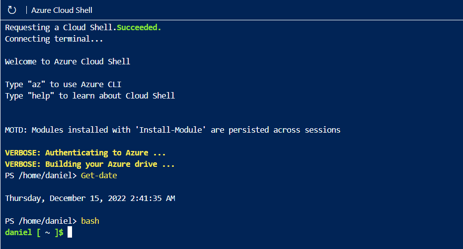
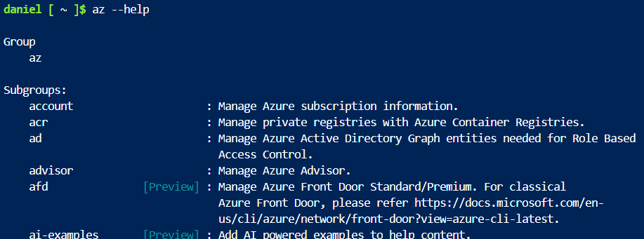
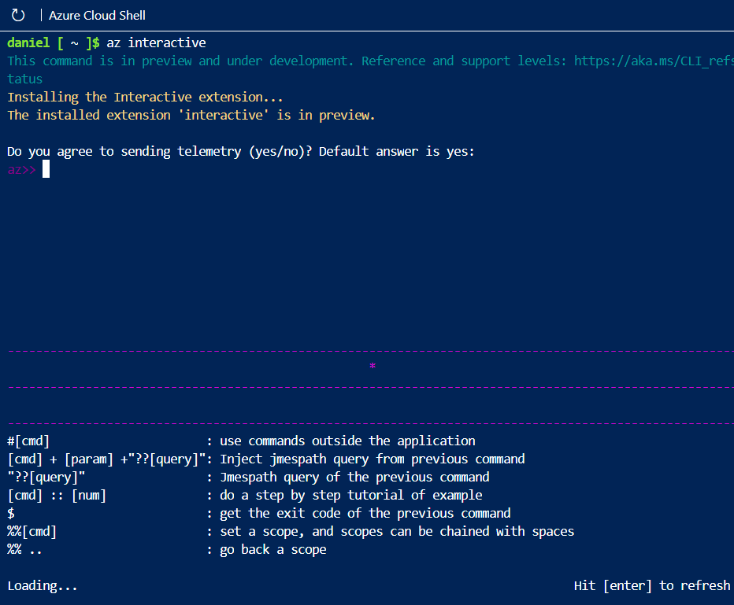
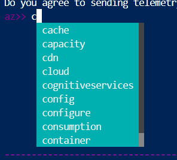

# Azure Cloud Shell

You can use `bash` if you're more familiar with bash-cli


You can use the `az` command to start an Azure command.


You can use the **Azure CLI interactive mode** which closely resembles an IDE. IT provides autocompletion, command descriptions, and even examples.




Other helpful commands:
|||
|-|-|
|`version`|prints out version|
|`upgrade`|updates azure|
|`exit`|exit out of azure interactive|

Sign in to [**Azure portal**](https://portal.azure.com/#home) to checkout the Azure web interface. 

# Creating a VM
From the azure cli, you can run `az vm create` command to create a VM.
```
az vm create \
  --resource-group learn-8bbeba09-81a7-4f75-8f7e-247c19a6eed8 \
  --name my-vm \
  --image UbuntuLTS \
  --admin-username azureuser \
  --generate-ssh-keys
```

Use `az vm extension set` command to configure Nginx:
```
az vm extension set \
  --resource-group learn-8bbeba09-81a7-4f75-8f7e-247c19a6eed8 \
  --vm-name my-vm \
  --name customScript \
  --publisher Microsoft.Azure.Extensions \
  --version 2.1 \
  --settings '{"fileUris":["https://raw.githubusercontent.com/MicrosoftDocs/mslearn-welcome-to-azure/master/configure-nginx.sh"]}' \
  --protected-settings '{"commandToExecute": "./configure-nginx.sh"}'
```

This command uses a custom script extension to run a bash script which is stored in github. To summarize, the script:
- runs `apt-get update`
- installs **`Nginx`**
- sets the home page to *`/var/www/html/index.html`* to print a welcome message that includes your VM's host name.

# Access your web server

Get the IP address for your VM and attempt to access your web server's home page

`az vm list-ip-addresses` to get your VM's IP address and store the result as a bash var.
```
IPADDRESS="$(az vm list-ip-addresses \
  --resource-group learn-8bbeba09-81a7-4f75-8f7e-247c19a6eed8 \
  --name my-vm \
  --query "[].virtualMachine.network.publicIpAddresses[*].ipAddress" \
  --output tsv)"
```

Then `curl` to download the home page:
```
curl --connect-timeout 5 http://$IPADDRESS
```

the `--conect-timeout` argument specifies to allow up to 5 seconds for the connection to occur. After 5 seconds, you get a *connection time out*.

We can print the IP address using `echo $IPADDRESS` to print the bash var and access it from our web browser.

The web server wasn't accessible so let's find out why.

### Listing the current network security group rules

```
az network nsg list \
  --resource-group learn-8bbeba09-81a7-4f75-8f7e-247c19a6eed8 \
  --query '[].name' \
  --output tsv
```
Output
```
my-vmNSG
```

Run `az network nsg rule list` to list the rules associated with NSG named *`my-vmNSG`*
```
az network nsg rule list \
  --resource-group learn-8bbeba09-81a7-4f75-8f7e-247c19a6eed8 \
  --nsg-name my-vmNSG
```

create a network security rule using the `az network nsg rule create` command
```
my azure cli sandbox is bugging and i cannot copy shit goodluck
```