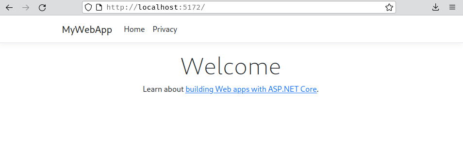

# ASP.NET - Hello world

it is an open source web framework for building fast and secure web apps and services with .NET, it is also cross platform. You can build your project on any operating system.
ASP.NET let's you build your web pages with a language called **razor**

> **razor** is HTML and C#. See the html hello world above, you can add C# with an `@` sign

For more info, checkout this [tutorial](https://dotnet.microsoft.com/en-us/learn/aspnet/hello-world-tutorial/intro).

Run this command on the terminal to create your Web App
```bash
~$ dotnet new webapp -o MyWebApp --no-https -f net6.0
```

> Explanation
> - `webapp` arguement specified to make a webapp **template**
> - `-o` parameter creates a new directory called *MyWebApp* where your web app will be stored
> - `--no-https` specifies not to enable https protocol
> - `-f` indicates to use net6.0

#### What were the files created
- `Program.cs` contains the app start up code and middleware configuration.
- `Pages` folder contains some example web pages for the app.
- `MyWebApp.csproj` defines the project settings such as `.NET SDK` version to target.
- `Properties/launchSettings.json` defines different profile settings for the local developement environment.

#### Run the app
run this command inside the WebApp directory
```bash
~$ dotnet watch
watch : Hot reload enabled. For a list of supported edits, see https://aka.ms/dotnet/hot-reload. Press "Ctrl + R" to restart.
watch : Building...
  Determining projects to restore...
  All projects are up-to-date for restore.
  MyWebApp -> /home/djdols/Projects/Coding/Tests/MyWebApp/bin/Debug/net6.0/MyWebApp.dll
watch : Started
info: Microsoft.Hosting.Lifetime[14]
      Now listening on: http://localhost:5172
info: Microsoft.Hosting.Lifetime[0]
      Application started. Press Ctrl+C to shut down.
info: Microsoft.Hosting.Lifetime[0]
      Hosting environment: Development
info: Microsoft.Hosting.Lifetime[0]
      Content root path: /home/djdols/Projects/Coding/Tests/MyWebApp/
```

The `dotnet watch` command will build and start the app, and then update the running app whenever you make code changes. 

As you can see from the output, it says `Now listening on: http://localhost:5172` which means we can access that address from our browser



## Hello World

edit `Pages/Index.cshtml` and replace the contents of the `<div>` tag withL

```html
<h1> Hello World </h1>
<p>The time on the server is @DateTime.Now</p>
```

now if we refresh the browser we'll see:


# ASP.NET Core MVC Web App

**References**
- [Create a ASP.Net Core MVC Web Application using **Visual Studio Code**](https://www.youtube.com/watch?v=HY7tD9IPfac)
- [With Identity](https://www.youtube.com/watch?v=JBvKjGjDOEk)
- [Using **SQLite** with Entity Framework Core](https://www.youtube.com/watch?v=hLe7e6ll0ec)
- [Adding Role based security](https://www.youtube.com/watch?v=9Aq09vM89_Q)

<sub><sup> Tutorials are in 2019 so might not work. just try it out</sup></sub>