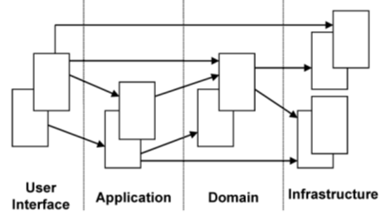
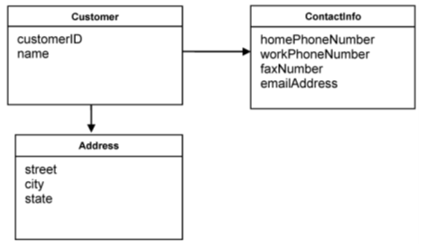

# Model-Driven Design

## **Layered Architecture**

It is possible for the domain part of the application to be small compared to the rest, since a typical application contains a lot of code related to database access, file or network access, user interfaces, etc.

In an Object-Oriented Program, UI, database, and other support code often gets written directly into the business objects. Additional business logic is embedded in the behavior of UI widgets and database scripts. It is the easiest way to make things work quickly.

But when domain-related code is mixed with other layers, it becomes extremely difficult to see and think about. Therefore, partition a complex program into *layers*.

|||
|-|-|
|**User Interface** (Presentation Layer)|Responsible for presenting information to the user and interpreting user commands.|
|**Application Layer**|Thin layer which coordinates the application activity. Does not contain business logic. Does not hold the state of the business objects, but it can hold the state of an application task progress.|
|**Domain Layer**|This layer contains information about the domain. Is the heart of the business software. The state of business objects is held here.|
|**Infrastructure Layer**|Acts as a supporting library for all other layers. It provides communication between layers, implements persistence for business objects, contains supporting libraries for the user interface layer, etc.|

Division of an application into layers can establish rules of interaction between them. If the code is not cleraly separated into layers, it will soon become so entangled that it becomes very difficult to manage changes. One simple change in one section of the code may have unexpected and undesirable results in other sections. 

The domain layer should be focused on core domain issues. It should not be involved in infrastructure activities. The UI should neither be tightly connected to the business logic, nor to the tasks which normally belong to the infrastructure layer. An application layer is necessary in many cases. There has to be a manager over the business logic which supervises and coordinates the overall activity of the application.

Examle: The user wants to book a flights route, and asks an application service in the application layer to do so.The application tier, fetches the relevant domain objects from the infrastructure and invokes relevant methods on them, e.g. to check security margins to other already booked flights. Once the domain objects have made all checks and updated their status to "decided", the application service persists the objects to the infrastructure.

## **Entities**

is a **representation of an object in the domain**. It is defined by its identity, rather than its attributes. It encapsulates the state of that object through its attributes, including the aggregation of other entities, and it defines any operations that might be performed on the entity.

Implementing entities in a software means creating identity. For a **`Person`** class, it can be a combination of attributes; name, date of birth, place of birth, name of parents, current address, Social Security Number, etc. For a **`BankAccount`**, the account number seems to be enough for its identity

## **Value Objects** 

There are cases  where we are not interested in which object is is, but solely on what attributes it has. An object that is used to describe certain aspects of a domain, and which dos not have an identity.

Example: 2DVector that represents a point in 2D space.

Having no identity, ValueObjects can easily be created and discarded.

If Value Objects are shareable, they should be immutable

## **Services**

There are some actions in the domain which do not seem to belong to any object. They represent important behavior of the domain, so they cannot be neglected or simply incorporated into some of the entities or value objects. For example; to transfer money from one account to another, should that function be in the sending account or receiving account? it feels misplaced either way.

When such behavior is recognized in the domain, the best practice is to declare it as a Service. Such an object does not have an internal state, and its *purpose is to simply provide functionality for the domain*.

There are 3 characteristics of a Service:
1. The operation performed by the Service refers to a domain concept which does not naturally belong to an Entity or Value Object.
2. The operation performed refers to other objects in the domain.
3. The operation is stateless.

## **Modules**
Modules are used as a method of organizing related concepts and tasks in order to reduce complexity.

Modules are widely used in most projects. It is easier to get the picture of a large model if you look at the modules it contains, then at the relationship between those modules. After the interaction between modules is understood, one can start figuring out the details inside of a module. 

## **Aggregates**
is a group of associated objects which are considered as one unit with regard to data changes. Each aggregate has one **root**; that root is an entity and is the only object accessible from outside.It can hold references to any of the aggregate objects, and other objects can hold references to each other, but an outside object can hold references only to the root object.

Similar to OOP Aggregation.

Since other objects can hold references only to the root, it means they cannot directly change the other objects in the aggregate. All they can do is to change the root, or ask the root to perform some actions. The root will be able to change other objects but that is an operation contained inside the aggregate. If the root is deleted, all other objects from the aggregate are deleted as well.

Example:

The customer is the root of the aggregate, and all the other objects are internal. If the Address is needed, a copy of it can be passed to external objects.

## **Factories**
Entities and Aggregates can often be large and complex, to o complex to create in the constructor of the root entity.
When object construction is a laborious process, creating the object involves a lot of knowledge about the internal structure of the object, about the relationships between the objects contained and the rules applied to them. This breaks encapsulation of the domain objects and of the aggregates. It's like we are given plastic, rubber, metal, silicon and we are building our own printer.
Factories are used to encapsulate the knowledge necessary for object creation, and they are especially useful to create Aggregates.

A **Factory method** is an object method which contains and hides knowledge necessary to create another object. 

## **Repositories**