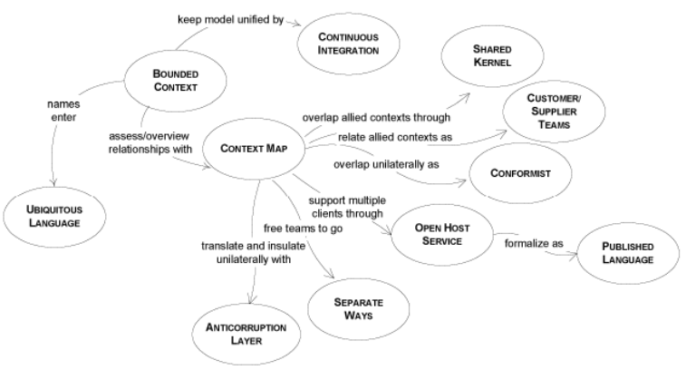

# Preserving Model Integrity

when multiple teams work on a project, code development is done in parallel, each team being assigned a specfic part of the model. Those parts are interconnected. They start with one big model and are given a share to implement.

When the design of the model evolves partially independently, we are facing the possibility to lose model integrity. Instead of trying to keep one big model that will fall apart later, we should conciously divide it into several models. Several models well integrated can evolve independelty as long sa they obey the contract they are bound to. Each model should have clearly delimited border, and their relationships between other models defined with precision.

## **Bounded Context**

Each model has a context. When we deal with a single model, the context is implicit.

There is no formula to divide one large model into smaller ones. Try to put in a model those elements which are related, and which form a natural concept. A model should be small enough to be assigned to one team.

The main idea is to **define the scope of a model**, to draw up the boundaries of its context. It is hard to keep a model pure when it spans the entire enterprise project, but it is much easier when it is limited to a specified area. Explicitly define the context within which a model applies. Explicitly set boundaries in terms of team organization, usage within specific parts of the application, and physical manifestations such as code bases and database schemas. Keep the model consistent within these bounsd and don't be distracted or confused by issues outside.

When different teams have to work on the same model, we must be constantly aware that changes to the model may break existing functionality. When using multiple models, everybody can work freely on their own peice. We all know the limits of our model, and stay within the borders. 

When have multiple models, we need to define the borders and relationships between each other. 

### **Example:** E-Commerce Applicationb
Let's say we have an Shoppee Clone, users can register and we collect their data including credit card info. Users can login, shop, place orders, etc. Then the app will need to publish an event whenever an order takes place because somebody will have to mail it. 

We want to make a reporting system to generate reports that will monitor the status of available goods, what the customer likes/dislikes, etc.

At the start, we create one model which covers the entire domain of e-commerce. But upon further consideration, we discover that the e-shop app is not really related to the reporting one. They have separate concern, operate with different concpets, and may need to use different technologies. The only common ground is the customer and merchandise data which both apps need to access.

It is recommended to create a separate model for each domain, one for e-commerce, and one for reporting. they can both evolve freely without much concern about each other, and become separate applications. We just need to make sure that the interface between them works well.

## **Continuous Integration**

When a number of people are working on the same Bounded Context, there is a strong tendency for the model to fragment. Breaking down the system into ever-smaller contexts eventually loses a valuable level of integration and coherency. 

We need to communicate with the team to make sure we all understand the role played by each element in the model. If one does not understand the relationship between objects, they may modify the code in such a way that comes in contradiction with the original intent. One member of the team might add code which duplicates existing code without knowing it, or they might add duplicate code instead of changing the current code, afraid of breaking existing functionality.

We must remember that a model is not fully defined from the beginning. It is created, then **it evolves continuously based on new insight** in the domain and feedback from the development process. New concepts may enter the model, and new elements are added to the code.

Continuous Integration is base don integration of concepts in the model, then finding its way into the implementation where it is tested.

## **Context Map**