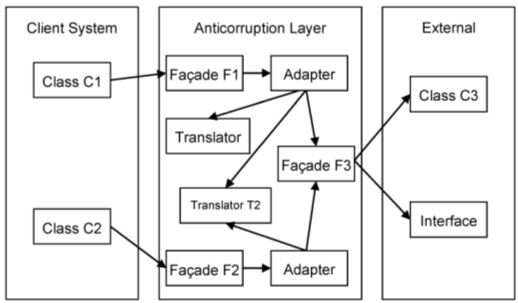

# Preserving Model Integrity

when multiple teams work on a project, code development is done in parallel, each team being assigned a specfic part of the model. Those parts are interconnected. They start with one big model and are given a share to implement.

When the design of the model evolves partially independently, we are facing the possibility to lose model integrity. Instead of trying to keep one big model that will fall apart later, we should conciously divide it into several models. Several models well integrated can evolve independelty as long sa they obey the contract they are bound to. Each model should have clearly delimited border, and their relationships between other models defined with precision.

## **Bounded Context**

Each model has a context. When we deal with a single model, the context is implicit.

There is no formula to divide one large model into smaller ones. Try to put in a model those elements which are related, and which form a natural concept. A model should be small enough to be assigned to one team.

The main idea is to **define the scope of a model**, to draw up the boundaries of its context. It is hard to keep a model pure when it spans the entire enterprise project, but it is much easier when it is limited to a specified area. Explicitly define the context within which a model applies. Explicitly set boundaries in terms of team organization, usage within specific parts of the application, and physical manifestations such as code bases and database schemas. Keep the model consistent within these bounsd and don't be distracted or confused by issues outside.

When different teams have to work on the same model, we must be constantly aware that changes to the model may break existing functionality. When using multiple models, everybody can work freely on their own peice. We all know the limits of our model, and stay within the borders.

When have multiple models, we need to define the borders and relationships between each other.

Each Bounded Context should have a name which should be part of the Ubiquitous language.

> ### **Example:** E-Commerce Application
> Let's say we have an Shoppee Clone, users can register and we collect their data including credit card info. Users can login, shop, place orders, etc. Then the app will need to publish an event whenever an order takes place because somebody will have to mail it. 
> We want to make a reporting system to generate reports that will monitor the status of available goods, what the customer likes/dislikes, etc. 
> At the start, we create one model which covers the entire domain of e-commerce. But upon further consideration, we discover that the e-shop app is not really related to the reporting one. They have separate concern, operate with different concpets, and may need to use different technologies. The only common ground is the customer and merchandise data which both apps need to access.

It is recommended to create a separate model for each domain, one for e-commerce, and one for reporting. they can both evolve freely without much concern about each other, and become separate applications. We just need to make sure that the interface between them works well.

## **Continuous Integration**

When a number of people are working on the same Bounded Context, there is a strong tendency for the model to fragment. Breaking down the system into ever-smaller contexts eventually loses a valuable level of integration and coherency.

We need to communicate with the team to make sure we all understand the role played by each element in the model. If one does not understand the relationship between objects, they may modify the code in such a way that comes in contradiction with the original intent. One member of the team might add code which duplicates existing code without knowing it, or they might add duplicate code instead of changing the current code, afraid of breaking existing functionality.

We must remember that a model is not fully defined from the beginning. It is created, then **it evolves continuously based on new insight** in the domain and feedback from the development process. New concepts may enter the model, and new elements are added to the code.

Continuous Integration is base don integration of concepts in the model, then finding its way into the implementation where it is tested.

## **Context Map**

An enterprise application has multiple models, and each model has its own bounded context. It is advisable to use the context as the basis for team organization. While every team works on its model, it is good for everyone to have an idea of the overall picture. A **Context Map** is a document which outines the different bounded contexts and the relationships between them. It can be a diagram, or any written document. the level of detail may vary. But what is important is that everyone working on the project shares and understands it.

The different models have to be integrated because each of their functionality is just a part of the entire system. In the end, the peices have to be assembled together.

If the contexts are not cleraly defined, it is possible they will overlap each other. If the relationships between contexts are not outlined, there is a chance they won't work when the system is integrated. Each Bounded Context should have a name which should be part of the Ubiquitous Language because it helps the team communication a lot when talking about the entire system. 

## **Shared Kernel**

Uncoordinated teams working on closely related applications can work smoothly for a while, but what they produce may not fit together. They can end up spending more on translation layers and retrofitting than they'd spend on continuous integration, losing the purpose of the Ubiquitous Language.

Designate some subset of the domain model that the two teams agree to share.

The purpose of Shared Kernel is to reduce duplication, but still keep two sepaate contexts.

Any change of the kernel should be communicated to another team, and the teams should be informed, making them aware of the new functionality.

## **Customer-Supplier**

There are times when two subsystems have a special relationship; one depends a lot on the other. They don't have a shared Kernel, it may not be conceptually correct to have one, or it may not even be technically possible. The two subsystems are in a Customer-Supplier relationship.

> ### **Example**: E-Commerce Application
> using the same previous example, The e-shopping app is just concerned about the user data, merchandise, and placed orders. It's not necessarily interested with what happens with the respective data. In the mean time, the reporting app is interested and needs the data saved by the e-shopping application. and additional information such as when customer drops items from the cart before checking out, or what other items they viewed often. Both applications will make use of the same database. The two teams will need to communicate, since they will work on the same database together.  
> The reporting team should play the customer role, while the e-shopping team plays the supplier role.

## **Conformist**
A Customer-Supplier relationship is viable when both teams are interested. The customer is ver dependent on the supplier but not the other way around. The supplier will need to pay attention and listen to the customer's needs.

If there is poor or lack of management, the supplier will slowly be more concerned about its model and design, and less interested in helping the customer. 

The result is that the customer team is on its own, trying to do their best with the model and the design.

The customer team has few options and the most obvious is that they may separate from the supplier and be completely on their own (Separate Ways Pattern).

If the customer has to use the supplier team's model, and if that is well done, it may be time for conformity.

## **Anticorruption Layer**

There are times we have to create an application that has to interact with legacy software or a separate application. It is a challenge because many legacy applications have not been built using domain modeling techniques, and their model is confused, entangled, hard to understand and hard to work with. But there has to be a level of integration between our model and the legacy one, because it is one of the requirements to use the old application.

There are ways for our client system to interact with an external one. One is via network connections. Both apps need to use the same network communication protocols and the client needs to adhere to the interface used by the external system.

Another method is the database. The external system works with the data stored in the database and the client is supposed to access the same database. But since the data in databases are primitive, the client application must understand the meaning of the data used.

One good implementation of an Anticorruption Layer is to see the layer as a *Service* from the client model. It abstracts the other system and let us address it in our own terms. The service will do the needed translation so our model remains insulated.

The Anticorruption Layer could also make use of an *Adapter* which allows you to convert the interface of a class to the one understood by the client.

## **Separate Ways**

is a pattern that addresses the case when an enterprise application can be made up of several smaller applications which have little or nothing in common from a modeling perspective. 

There is a single set of requirements, and frmo the user's perspective this is one application, but from a modeling and design point of view, it may be done using separate models with distinct implementations. 

Before going on Separate Ways, we need to make sure that we won't return to an integrated system. Models developed independently are very difficult to integrate. They have so little in common that it's just not worth it.

## **Open Host Service**

When we try to integrate two subsystems, we usually create a translation layer between then. If the external subsystem turns out to be used not by one client, but several, we need to create translation layers for all of them. This can be trouble some. There is more and more to maintain and to worry about. The solution is to see the external subsystem as a provider of services. We can wrap a set of service arount it, then all other subsystems will access these services, and we won't need any translation layer.

## **Distillation**

is the process of separating the substances composing a mixture. The purpose is to extract a particular substance.

A large domain has a large model even after we have refined it and created many abstractions. It may remain big after many refactoring. In a situation like this, it may be a time for distillation. 

The idea is to define a Core Domain which represents the essence of the domain. The byproducts of the distillation process will be generic subdomains which will comprise the other parts of the domain.

When working with a large model, we should try to separate the essential concepts from generic ones.