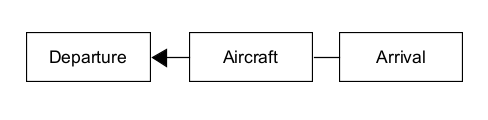
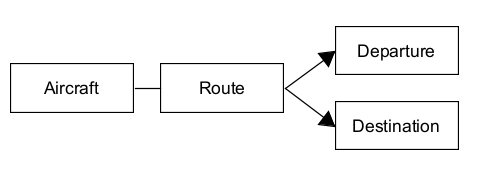
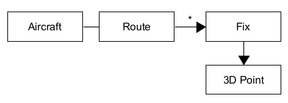
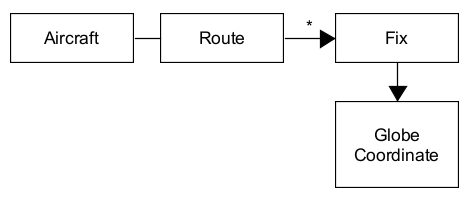

# Domain Driven Design

In order to create good software, you have to know what that software is all about. You can't create a banking software system unless you have a good understanding of what banking is; to understand the *domain* of banking.

The software architect, software analyst, and developer does not know banking. The bankers do.

The software must fit harmoniously with the domain and the best way to do it is to make software a *reflection of the domain*.

We need to create an abstraction of the domain, and we learn a lot about a domain while talking with the domain experts.

*"A domain model is not a particular diagram; it is the idea that the diagram is intended to convey"* -Eric Evans

A specific domain could be more than a human mind can handle at one time. We need to organize information; systematize it, to divide it up in smaller pieces, to group those pieces into logical modules, and take one at a time and deal with it. We even need to leave some parts of the domain out. Deciding *"What to keep and what to throw away?"*.   The banking software will keep track of the customer's address, but should not care about their eye color. That is an obvious case, but other examples might not be so obvious.

While the waterfall approach may lead to over-engineering, the fear of over-engineering may lead to another fear; the fear of doing a deep, thoroughly thought out design. Domain Driven Design combines design and development practice, and shows how design and development can work together to create a better solution. Good design will accelerate development, while feedback coming from the development process will enhance the design.

## Sample Case: Airplane Flight Control
Thousands of planes are flying their own paths towards their destinations, and it is important to make sure they do not collide in the air. The proposed project is a monitoring system which tracks every flight over a certain area, determine if the flight follows its supposed route or not, and if there's a possibility of a collision.

You need to extract essential information and generalize it. Let's say you're talking to the Air traffic controllers who are the domain specialists and you hear a lot of aircrafts taking off, and landing. The controller and you agree that each aircraft has a departure and destination airfield so you come up with this.

Ok, but what happens in the air? We are more interested in what happens while it is airborn. The controller says that each plane is assigned a flight plan which is supposed to describe the entire travel. After further discussion, you hear the word: route. It contains an important concept of flight travel. Planes follow a route when they are flying and that the departure and arrival stations are the starting and end point of the route. Instead of associating the aircraft with the departure and arrival points, it is more natural to associate it with a route.

As further discussion oges on, you discover that the route is made up of small segments, which constitute some sort of a crooked line from departure to destination. The line is supposed to pass through predetermined fix points. So a route can be considered to be a series of consecutive fixes. At this point, you no longer see the departure and destination as the terminal points of the route, but just another two of those fixes.

You express the fixes as a 3D Coordinate but the controller does not see it that way, they actually see it as points on the earth's surface which is uniquely determined by their latitude and longitude. So we revise:

You and the domain experts are talking, exchaning knowledge. You ask questions and they respond. While they do, they dif essential concepts out of the air traffic domain. 

We, the software specialists (software architects and developers) and the domain experts, are creating the model of the domain together, and the model is the place where those two areas of experties meet.

