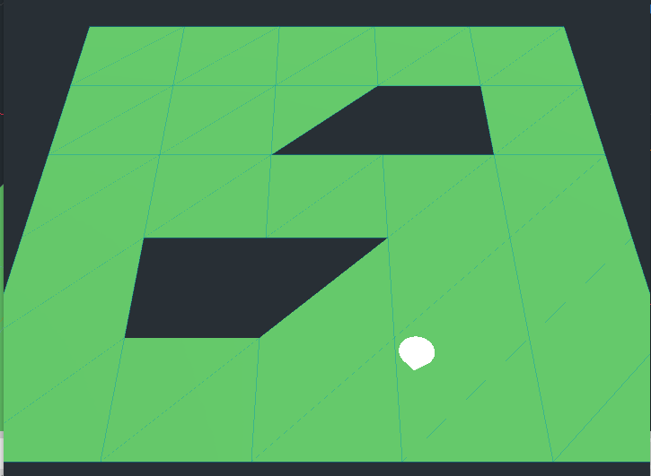

# 3D Mouse Press



When you press your mouse on the plane, it will send the white thing to where you pressed in 3D space


```C#


public void HandleMouseClick(InputEventMouseButton e)
{

    if(e.Pressed){

        Vector2 mousePos = e.Position;
        PhysicsDirectSpaceState spaceState = GetWorld().DirectSpaceState;
        Camera camera = GetViewport().GetCamera();

        Vector3 rayOrigin = camera.ProjectRayOrigin(mousePos);
        Vector3 rayEnd = rayOrigin + camera.ProjectRayNormal(mousePos) * 2000;

        Godot.Collections.Dictionary intersect = spaceState.IntersectRay(rayOrigin, rayEnd);

        if(intersect.Count>0)
            Vector3 hitPoint = (Vector3)intersect["position"];

            /*hitPoint is the Vector3 representing where you pressed in 3D space*/
        
    }
}
```