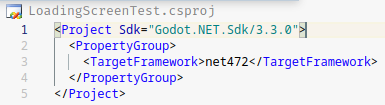

# Godot-Mono

We have already established long ago that GDscript is whack. It is good for making prototypes but you can hardly make organized code with it (like applying abstraction, polymorphism, encapsulation, etc.). So we use Godot-Mono since it's easy and it satisfies our needs.

## Setup

Download [Godot-mono](https://godotengine.org/download) from the official godot website. According to the website, it requires [.NET SDK](https://archlinux.org/packages/community/x86_64/dotnet-sdk/) or [Mono](https://archlinux.org/packages/extra/x86_64/mono/).

> According to the fine gentlemen from the Godot Discord server *#csharp text-channel*, you'll only ever need Mono if you need to **compile** Godot.

Godot, as the time of writing this, uses **NET472**. If you open a godot project `.csproj` file, you will see something like this:



This is especially useful if you want to create a csproj for unit testing your godot project.

> **Remember when**: while making your thesis game project *Assembly Robot Game*, where you wrote unit tests for the CPU simulator components and Assembler, the entire testing project was in **.NET6**, and when the time comes to make the game, there were incompatible syntaxes and class members because Godot is using **.NET472**

## Running
run the godot **project list** by going to the directory of the godot binary and execute the command 

`$ ./godot-bin.x86_64` 

to open a godot project immediately, the binary recieves an arguement which is the path to a `project.godot` file which is inside your godot project folders

`$ ./godot-bin.x86_64 path/to/project.godot`

---
## Signals

`Godot.Object.Signal(string signal, Object target, string method)`

the Object will call target.method when Object.signal is emitted. For example:

```C#
public override void _Ready(){
    timer = GetNode<Timer>("Path/To/Timer");
    timer.Connect("timeout", this, "timerTimedOut");
}

public void timerTimedOut(){
    // code here will be executed 
    // when timer emmits "timeout" signal
}
```

## yield()
<sup><sub>**tags**: yield, delay, async, wait</sub></sup> 

to make a delay in GDScript:

```Python
# execute code here

yield(get_tree().create_timer(0.5f), "timeout" )

# code here will be executed 0.5 seconds later
```


in C#, it is much more complex since making a delay requires an **async** call.

```C#
// execute code here

async void functionName(){
    await ToSignal( GetTree().CreateTimer(0.5f), "timeout" );
    
    // code here will be executed 0.5 seconds later
}

// code here will be executed immediately
```
