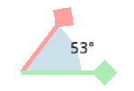

## Vector Length

Say we have vector $\vec{a} = (x,y)$. That vector can be represented as a triangle where x is the adjacent edge and y is the opposite edge.

The hypotenuse is the length of $(x,y)$ which can be solved using the Pythagorean theorem $c =\sqrt{ a^2 + b^2 }$

The length of $\vec{a}$ is denoted as: $|\vec{a}| = \sqrt{x^2 + y^2}$

> This works for all vectors, for 3D, just include z  
> $|\vec{v}| = \sqrt{x^2 + y^2 + z^2}$

## Vector Dot product
Multiply each same dimension of the vector with each other and add the total

$ \vec{a} • \vec{b} = a$$x$ $b$$x$ $+ a$$y$$b$$y$

For normalized vectors, special cases occur such as:
|Special Cases| Normal Cases|
|-|-|
|| | 
|both vectors face  exactly the **same** direction|both vectors face the same direction but not equal|
||| 
|both vectors face   exactly **opposite** directions|both vectors oppose directions|
|| 
|vectors forming a 90° angle|

## Vector Normalization

is the process of converting a vector for it to have the [vector length](#vector-length) of 1

The normalized vector of $\vec{v}$ is denoted as  $\hat{v} = \frac{ \vec{v} }{ |\vec{v}|}$

## Vectors and Angles

To find the angle of two vectors:
1. [normalize](#vector-normalization) the two vectors
2. get the [dot product](#vector-dot-product) of the two vectors
3. $cos^{-1}$ the result

$θ = cos^{-1}(\hat{a} • \hat{b})$

