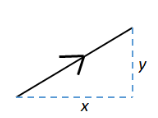

# Mathematics

for formulas that are useful for game developement but I will probably forget.

## Vector Length

Say we have vector $\vec{a} = (x,y)$. That vector can be represented as a triangle where x is the adjacent edge and y is the opposite edge.

The hypotenuse is the length of $(x,y)$ which can be solved using the Pythagorean theorem $c =\sqrt{ a^2 + b^2 }$

## Vector Normalization

is the process of converting a vector for it to have the **length** of 1
