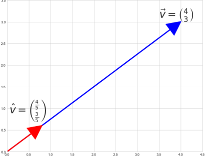

# Mathematics

for formulas that are useful for game developement but I will probably forget.

## Vector Length

## Vector Normalization

is the process of converting a vector for it to have the **length** of 1
