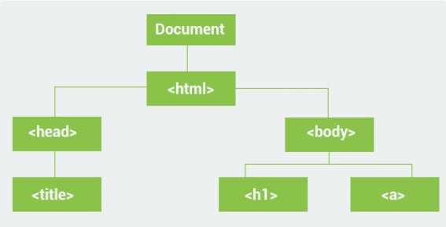
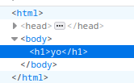
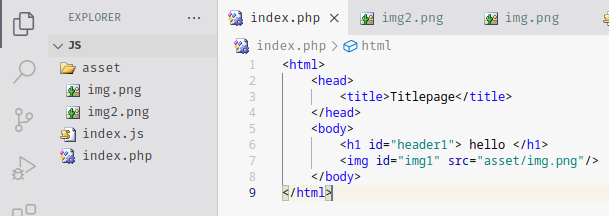
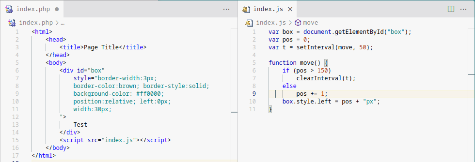

# Document Object Model
Represents the document as a tree structure. HTML elements become interrelated **nodes** in the tree.
Nodes have **child** nodes. Nodes on the same tree level are called **siblings**

> `<html>` has two children; `<head>` and `<body>`

```javascript
document.body.innerHTML = "<h1> yo </h1>";
```
outputs:<br>



## Selecting elements
All HTML elements are **objects**. The **document** object has methods that allow you to select the desired HTML element. Example:
```html
<html>
    <head>
        <title>Titlepage</title>  
    </head>
    <body>
        <h1 id="header1"> hello </h1>
        <div id="div1">
            <p class="prg">This is paragraph1</p>
            <p class="prg">This is paragraph2</p>
        </div>
    </body>
</html>
```

```javascript
document.getElementById("div1");
```
> outputs: `<div id="div1">`

```javascript
document.getElementsByClassName("prg");
```
> outputs: `HTMLCollection { 0: p.prg, 1: p.prg, length: 2 }`

```javascript
document.getElementsByTagName("p");
```
> outputs: `HTMLCollection { 0: p.prg, 1: p.prg, length: 2 }`
> `HTMLCollection` can be used **like an array**

### DOM Element Properties

|Property|description|<sub><sup>Using the same example above</sup></sub>|
|-|-|-|
|`innerHTML`|<sub><sup>gets the absolute HTML text inside the element including line breaks and tags|`document.getElementById("div1").innerHTML;`<br> <sub>`"\n            <p class=\"prg\">This is paragraph1</p>\n            <p class=\"prg\">This is paragraph2</p>\n   `</sub>|
|`innerText`|<sub><sup>gets the inner text trimmed|`document.getElementById("div1").innerText;`<br><sub>`"This is paragraph1\n\nThis is paragraph2"`</sub>|
|`children`|<sub><sup>returns an array of the child nodes|`document.getElementById("div1").children`<br><sub>`HTMLCollection { 0: p.prg, 1: p.prg, length: 2 }`</sub>|
|`parentNode`||`document.getElementById("div1").parentNode`<br><sub>`<body>`|
|`firstElementChild`||`document.getElementById("div1").firstElementChild.innerText`<br><sub>`"This is paragraph1"`|
|`lastElementChild`||`document.getElementById("div1").lastElementChild.innerText`<br><sub>`"This is paragraph2"`|
|`previousElementSibling`|||
|`nextElementSibling`|||

> I dunno my learning resource showed different information. must be outdated.
> <br>You can always check using your browser console though

## Changing Element Attributes
Say we have this project:<br>


we can change `#img1.src` by doing:

```javascript
document.getElementById("img1").src = "asset/img2.png" 
```

You can even change style properties:
```javascript
document.getElementById("div1").style.backgroundColor = "#dcdddf";
```

## Adding & Removing Elements

```javascript
element.cloneNode();
```
to clone an element. if you append an element that is in the tree, it will move and fuck up the tree.

```javascript
document.createElement(element);
```
 creates a new element w the tag name : *element* parameter

 ```javascript
 var elem = document.createElement("div");
 elem.id = "div3";
 elem.innerText = "i hate sex";

document.appendChild(elem);
```
adds the element
```html
<div id="div3">i hate sex</div>
```

to remove a child:
```javascript
element.removeChild(elem);
```

to replace a parent's child with a newOne:
```javascript
parent.replaceChild(newOne, child);
```

## Animations


> `setInterval(handler, ms, args?)` will call `handler` with parameters `args` every `ms` milliseconds.<br>
> `clearInterval(obj)` will stop the shit idk what object type it returns because JAVASCRIPT is so goddamn confusing <3
