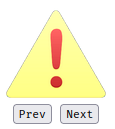
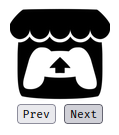
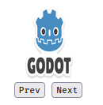
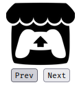
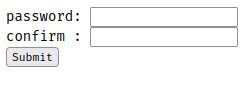
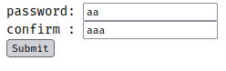
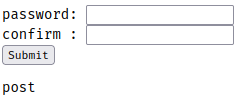

# Events
|event|description|
|-|-|
|`onclick`|when element is clicked|
|`onload`|when element is loaded|
|`onunload`|when a page has unloaded (for `<body>`)|
|`onchange`|occurs when the content of a form element, selection or the checked state have changed.<br> for `<input>, <keygen>, <select>, <textarea>`|
|`onmouseover`|when the pointer is **moved onto** an element or one of its children|
|`onmouseout`|when the pointer is **moved out of** an element or one of its children|
|`onmousedown`|occurs when the user **pressed** a mouse button over an element|
|`onmouseup`|occurs when the user **released** a mouse button over an element|
|`onblur`|occurs when an element **loses focus**|
|`onfocus`|occurs when an element **gets focus**|

corresponding events can be added to HTML elements as attributes like: <br>
```html
<p onclick="someFunc()">Some text</p>
<script>
function someFunc(){
    alert("death");
}
</script>
```

in javascript, you can set these event handlers by assigning a function to them:
```javascript
var x = document.getElementById("someid");
x.onclick = function(){
    // some code to execute
}

// alternatively

function someFunc(){
    // some code
}

x.onclick = someFunc;
```

### Event Listener
the `addEventListener()` method connects an event handler to an element without overwriting existing event handlers. You can add *many* event handlers to one element, or many event handlers to the same type to one element. like two "click" events.

```javascript
element.addEventListener(event, func, useCapture);
```
**`event`** param is a string of which event. If you want to handle an `onclick` event, you use `"click"` arguement.<br>
**`func`** is the function we want to call when the event occurs.<br>
**`useCapture`** is a boolean specifying whether to use event **bubbling** or event **capturing**. but this parameter is optional.

```javascript
element.removeEventListener(event, func, useCapture);
```
use this method to remove listeners. the parameters are the same.

Example:

```html
<html>
	<head>
		<title>Page Title</title>
	</head>
	<body>
		<button id="btn1">Click Me please</button>
		<button id="btn2">Click Me to shut button 1 up</button>
		<script src="index.js"></script>
	</body>
</html>
```

```javascript
var btn1 = document.getElementById("btn1");
var btn2 = document.getElementById("btn2");

function btn1_click() {
    alert("you clicked me.");
}

btn1.addEventListener("click", btn1_click);

btn2.addEventListener("click", function () {
    alert("now i will remote btn1 event listener");
    btn1.removeEventListener("click", btn1_click)
});
```

## Event Propagation

Event propagation allows for the definition of the element order when an event occurs. If you have this:
```html
<div>
    <p></p>
</div>
```

and the user  clicks on the `<p>` element, which element's "click" should be handled first?

In **bubbling**, the innermost element's event is handled first, and then the outer elements.
`<p>.onclick` is called, and then `<div>.onclick`

In **capturing**, it's the opposite.
`<div>.onclick` and then `<p>.onclick`.

> Capturing goes **down** the DOM. <br>
> Bubbling goes **up** the DOM.

Say for example we have this code:

If the innerbox is clicked, this happens:

`innerbox.onclick` is called first, and then the `outerbox`

but if i set the 3rd parameter of **both** event listeners to **true**, then it will show this result:


`outerbox.onclick` is called first before `innerbox.onclick`

> The default event propagation is **bubbling**<br>
> Set both propagation to be equal to prevent confusion.

---
## Exercise: Image Slider

Image slider page with **prev** and **next** buttons.

|||
|-|-|
|||

```html
<div id="imageSlider" style="text-align:center">
	<br>
	<button id="prev"> Prev </button>
	<button id="next"> Next </button>
</div>
<script src="index.js"></script>
```

```javascript
var imgObj = document.getElementById("imageViewer");
var imgs = [
    "asset/img1.png", "asset/img2.png", 
	"asset/img3.png",
];
var img_idx = 0;

function setImage(idx) {
    img_idx = idx % imgs.length;
    if (img_idx < 0) img_idx = imgs.length - 1;
    imgObj.src = imgs[img_idx];
}


prevbtn = document.getElementById("prev");
nextbtn = document.getElementById("next");

prevbtn.addEventListener("click", function () {
    setImage(img_idx - 1);
})

nextbtn.addEventListener("click", function () {
    setImage(img_idx + 1);
})
```
---

## Form Validation

```html
<form onsubmit="return validate()" method="post">
	password: <input type="password" name="num1" id="num1"/> <br>
	confirm : <input type="password" name="num2" id="num2"/> <br>
	<button type="submit">Submit</button>
</form>

<?php
	if($_SERVER['REQUEST_METHOD'] == 'POST') echo "post";
?>
```
```javascript
function validate() {
    var n1 = document.getElementById("num1");
    var n2 = document.getElementById("num2");

    if (n1.value == n2.value) return true;
    else {
        console.log("passwords dont match")
        return false;
    }
}
```

||||
|-|-|-|
|**initial**: a GET request is submitted<br>|onSubmit with unequal values:<br>**no http request is made** and <br><sub><sup>`console.log("passwords don't match")`</sub></sub>|equal values were submitted so<br>a POST request was sent thus:<br> <sub><sup>`echo "post"`</sup></sub>|

> `<form>.onsubmit` is used to check whether to submit or not. If it returns true, then it submits. Otherwise, no. 
