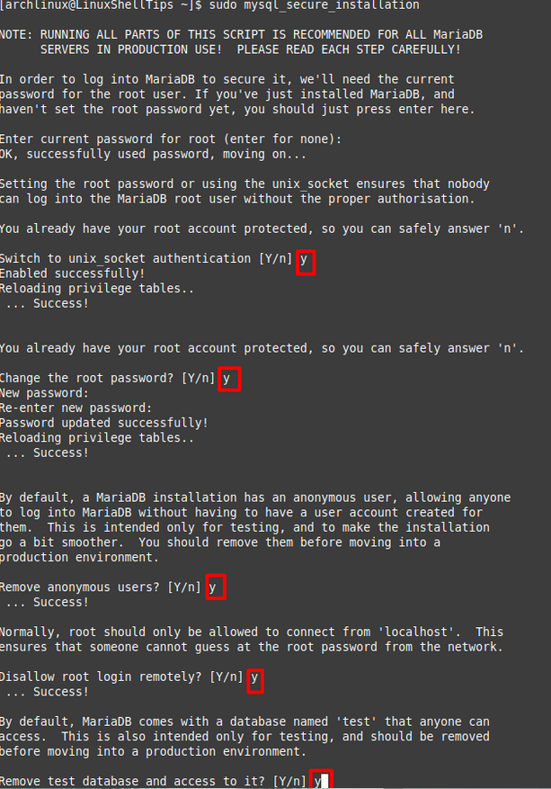

# LAMP STACK

[Arch Linux Lamp Stack installation Video](https://www.youtube.com/watch?v=GYnmm97bPxg)

**L**inux, **A**pache, **M**ariaDB, **P**hp


### Setup

Install first the necessary packages
```
# pacman -S apache php php-apache mysql
```


## Apache
[Apache HTTP Server](https://wiki.archlinux.org/title/Apache_HTTP_Server) is a server hosting service. By default it will serve the directory `/srv/http` to anyone who accesses your server. 

**config file** - `/etc/httpd/conf/httpd.conf`

Start the apache daemon `httpd.service` using **systemd**

#### Apache - PHP extension

using **libphp**, the easiest method but also the least scalable. Check [this link](https://wiki.archlinux.org/title/Apache_HTTP_Server#PHP) for more info. install **php-apache**

In `/etc/httpd/conf/httpd.conf`:

Comment this line:
```
#LoadModule mpm_event_module modules/mod_mpm_event.so
```

And uncomment this line:
```
LoadModule mpm_prefork_module modules/mod_mpm_prefork.so
```
This is required to mitigate an mpm error.

To enable PHP, add these lines at the end of `/etc/httpd/conf/httpd.conf`

```
LoadModule php_module modules/libphp.so
AddHandler php-script .php
Include conf/extra/php_module.conf
```

then restart `httpd.service`

## MariaDB
[MariaDB](https://wiki.archlinux.org/title/MariaDB) is a full-featured database server which aims to be an **always free**, backward compatible, replacement for **MySQL**.

run the following command **before** starting the `mariadb.service`
 ```
 # mariadb-install-db --user=mysql --basedir=/usr --datadir=/var/lib/mysql
 ```

 now `mariadb.service` can be started.


 Now improve initial security for MariaDB
 ```
 # mysql_secure_installation
 ```

 

 ## PHP
 [Php](https://wiki.archlinux.org/title/PHP) is a widely-used general-purpose scripting language that is especially suited for Web development and can be embedded into HTML. 

### PHP - extensions
 Install **php-gd** for some graphics library and uncomment the line in `/etc/php/php.ini`
 ```
 extension=gd
 ```

 for MySQL/MariaDB, uncomment in `/etc/php/php.ini`:
 ```
 extension=pdo_mysql
 extension=mysqli
 ```

 > or you can use postgresql