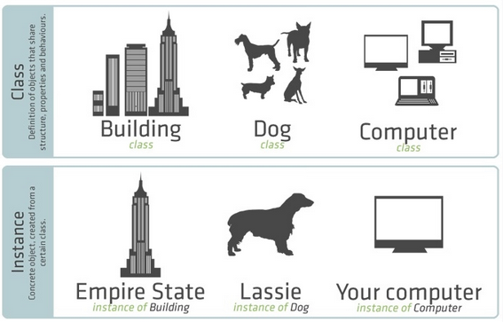

# PHP - Object Oriented Paradigm
## Classes & Objects


- access modifier rules are the same
- has constructor/deconstructor
- inheritance, function override, etc

```php
class Person{
  public $name;

  // constructor
  public function __construct($n){
    $this->name = $n;
  }

  public function __destruct(){
    echo "$this->name Destroyed";
  }

  public function greet(){
    echo "Hi my name is ".$this->name.". Nice to meet you.";
  }
}

$p1 = new Person("Bobby");
$p1->greet(); // outputs "Hi my name is Bobby. Nice to meet you."
echo $p1->name; // outputs "Bobby"
unset($p1); // outputs "Bobby Destroyed" 
```

> use `$this` to access class members.<br> `unset()` to destroy objects

### PHP Class Inheritance

```php
class Animal{
  protected $name;
  
  public function __construct($n){
    $this->name = $n;
  }

  public function speak(){
    echo "$this->name: ...<br>";
  }
}

class Dog extends Animal{
  public function speak(){
    echo "$this->name: Bark!<br>";
  }
} 

(new Animal("Bob"))->speak(); 
(new Dog("Carl"))->speak();
```

> **outputs**:<br> Bob: ...<br>Carl: Bark!

### PHP Class Interface

An **interface** specifies a list of methods that a class **must** implement otherwise it will cause an error. However, the interface itself does not contain any method implementations.

```php
interface AnimalInterface {
    public function makeSound();
}

class Dog implements AnimalInterface {
    public function makeSound() {
        echo "Woof! <br />";
    }
}
class Cat implements AnimalInterface {
    public function makeSound() {
        echo "Meow! <br />";
    }
}
```

Classes can implement mutiple interfaces separated by a comma
```php
class Demo implements AInterface, BInterface, CInterface {
  // Functions declared in interfaces must be defined here
}
```

## Abstraction
Abstract classes cannot be instantiated. Abstract functions must be implemented by the inheritor. Otherwise error. 
```php
abstract class Animal{
    protected $name;

    public function __construct($name){
        $this->name = $name;
    }
    abstract public function makeSound();
}

class Dog extends Animal{
    public function makeSound(){
        echo "bark";
    }
    public function howl(){
        echo "awoooo >:(";
    }
}
```
## Static
**static** members are not owned by instantiations
```php
class myClass{
    static $myProperty = 42;

    static function myMethod(){
        echo "myProperty:".self::$myProperty;
    }
}

echo myClass::myMethod();
echo myClass::$myProperty;
// outputs: myProperty:4242 
```

## Final
```php
class myClass{
    final function myFunc(){
        echo "a";
    }
}

class myClass2 extends myClass{
    function myFunc(){
        // error
    }
}
```
> **ERROR**: Cannot override final method myClass::myFunc()

```php
final class myClass{
}

class myClass2 extends myClass{
}   
```
> **ERROR**: Class myClass2 cannot extend final class myClass