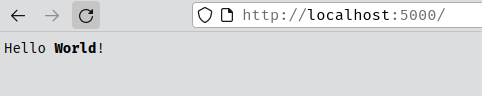
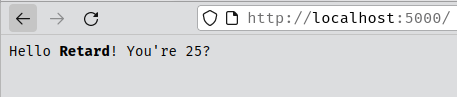
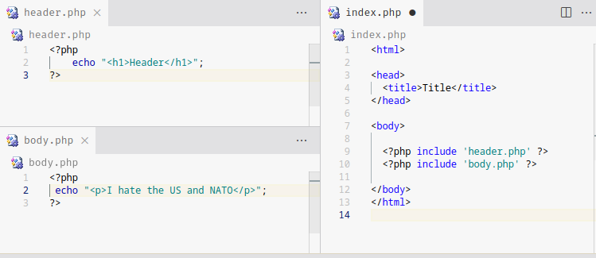
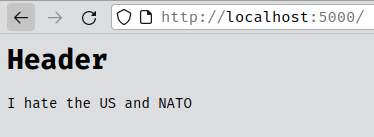

# PHP - basics

#### Learning Resources
- [Php in 100 Seconds](https://www.youtube.com/watch?v=a7_WFUlFS94)
- [Php in 15 minutes](https://www.youtube.com/watch?v=ZdP0KM49IVk)
- [Php playlist](https://www.youtube.com/playlist?list=PL0eyrZgxdwhwBToawjm9faF1ixePexft-)
- Sololearn - PHP

### Server
php can host a server on it's own without apache or whatever
```bash
php -S <address>:<port>
```

## Syntax

PHP file
```php
// some or no html outside 
<?php
    echo "Hello World!";
    // PHP code in here
?>
```

HTML markup can be included to the text in the **echo** statement
```php
    <?php
        echo "Hello <strong>World</strong>!";
    ?>
```


## Variables
Php Variable Grammar: `[a-zA-Z0-9_]{1,}` case-sensitive

```php
<?php
    $name = 'Retard';
    $age = 25;
    echo "Hello <strong>$name</strong>! You're $age?";
  ?>
```


### Constants

```php
<?php
    define("MSG", "I need to shit");
    echo MSG;
?>
```
outputs `"I need to shit"`

## Variables
Variables can store string, int, float, bool, array, object, NULL, or Resource.

> You can concatenate two variables together like: <br>
> `echo $s1.$s2`

You can arithmetically add variables as well even for strings <sub><sup>lmao is this javascript</sup></sub>
```php
<?php
    $string1 = "5";
    $int1 = 3.14;
    $sum = $string1 + $int1;

    echo $sum;
?>
```

### Scopes
variables declared outside a function has **global scope**.<br>
variables declared inside a function has a **local scope**. It can only be accessed within the function. 

```php
<?php
    $name = 'Dave';

    function printName(){
        echo $name;
    }
    printName();
    // Error: Undefined variable "name"
?>
```

> the script will produce an error since **$name** has a global scope and is not accessible within the **printName** function

To access a global variable; use the **global** keyword
```php
<?php
    $name = 'Dave';

    function printName(){
        global $name;
        echo $name;
    }
    printName();
    // outputs 'Dave'
?>
```

### Variable variables
you can use one variable to specify another variable's name

```php
<?php
    $a = 'hello';
    $hello = 'hi';

    echo $a . "<br>";
    echo $$a;

    /* Outputs:
    hello
    hi
    */
?>
```
`echo $a` gets the value of variable:a = `"hello"` <br>
`echo $$a` gets the value of the variable:`hello` = `"hi"` <sup><sub>bruh</sub></sup>

## Operators
Quite same as any other language
### Arithmetic Operators
|Operator|Name|Example|
|-|-|-|
|+|Add|`$x + $y`|
|-|Sub|`$x - $y`|
|*|Mul|`$x * $y`|
|/|Div|`$x / $y`|
|%|Mod|`$x % $y`|
|++|Inc|`$x++` post-increment<br> `++$x` pre-decrement|
|--|Dec|`$x--` post-increment<br> `--$x` pre-decrement|

### Assignment Operators
|Operator|Same as...|
|-|-|
|`x+=y`|`x=x+y`|
|`x-=y`|`x=x-y`|
|`x*=y`|`x=x*y`|
|`x/=y`|`x=x/y`|

### Comparison Operators
|Name|Example|Result|
|-|-|-|
|Equal|`$x == $y`| Returns true if<br>**$x is equal to $y**|
|Not Equal|`$x != $y` or <br> `$x <> $y`| Returns true if<br>**$x is not equal to $y**|
|Identical|`$x === $y`| Returns true if<br>**$x is equal to $y** and<br>**same data type**|
|Not Identical|`$x !== $y`| Returns true if<br>**$x is not equal to $y** or<br>**different data type**|
|Greater Than|`$x > $y`| |
|Greater Than<br>or equal to|`$x >= $y`| |
|Less Than|`$x < $y`| |
|Less Than<br>or equal to|`$x <= $y`| |

### Logical Operators

|Operator|Example|Result|
|-|-|-|
|`and`,`&&`| `$x and $y`<br>`$x && $y` 
|`or`,`\|\|`| `$x or $y`<br>`$x \|\| $y` 
|`xor`| `$x xor $y` | 
|`!`| `!$x` | 

# Arrays
### Numeric arrays
are arrays addressible by index
```php
$names = array("watson", "wilson", "hudson");
echo $names[2]; // outputs "hudson"
```

Arrays can have any data types together.
```php
$datas = array("Watson", 2);
echo "$datas[0] is $datas[1]";
```

### Associative Arrays
are arrays that use named keys like a dictionary.

```php
$people = array(
    "Watson"=>22,
    "Wilson"=>"Retarded",
    "Hudson"=>19
);

echo $people['Watson'] . ", " . $people["Wilson"];
// outputs "22, Retarded"
```

### Multi-Dimensional Arrays

Since array elements can be any data type, you can put arrays as an array element

```php
$people = array(
    'online' => array('bob3', 'johndoe'),
    'offline' => array('Xi', 'mark', 'bob21'),
    'away' => array('emily','jona')
);

echo $people['online'][1]; 
echo $people['offline'][2];
```

> you can use `sizeof()` to get array length

## Control structures

### Conditions
if-else statements are the same as other languages.

```php
if(condition){
    // code executed if condition is true
}elseif(another condition){
    // code executed if another condition is true
}else{
    // code executed otherwise
}
```

### Loops
loops are same-same
```php
while(condition){
    // code here
}

do{
    // code here
}while(condition)

for(init; condition; increment){
    // code here
}
```

some samples
```php
for($a = 0; $a<5; $a++){
    echo "value of a is ". $a ."<br/>";
}
```

#### foreach loop
```php
$names = array("Bob","Ong","Mid");
foreach($names as $name){
    echo $name . "<br/>";
}
```
> **Outputs:**<br> Bob<br>
Ong <br>
Mid <br>

```php
$props = array(
    "Name" => "Bob",
    "Age" => "20"
);
foreach($props as $key => $value ){
    echo $key . " is " . $value ."<br/>";
}
```
> **Outputs:**<br>Name is Bob<br>
Age is 20 <br>

### switch
```php
switch(n){
    case value1:
        // ==value1
    break;
    case value2:
        // ==value2
    break;
    default:
    // no match found
}
```

Sample
```php
$today = "Wed";

switch($today){
    case "Mon":
    echo "I hate Mondays";  
    break;
    case "Wed":
    echo "It's Wednesday my dudes";  
    break;
    case "Sun":
    echo "Ion wanna go to church";
    default:
    echo "ok";
}

// outputs: "It's Wednesday my dudes"
```

## include and require
the **include** statement allow for the insertion of the content of one PHP file into another, before the server executes it.





the **require** statement is identical to **include** in which it inserts another file BUT; upon failure, it produces a **fatal error** and cease the execution, unlike in **include**, it will just print in the console a warning and move on.

#### Include warning for non-existent file
```php
<?php include 'nofile.php' ?>
```

```
[date and time] PHP Warning:  include(nofile.php): Failed to open stream: No such file or directory in <directory>
[date and time] PHP Warning:  include(): Failed opening 'nofile.php' for inclusion (include_path='.:') in <directory>
```

#### Require warning for non-existent file
```php
<?php require 'nofile.php' ?>
```
```
[date and time] 127.0.0.1:39112 [500]: GET / - Uncaught Error: Failed opening required 'nofile.php' (include_path='.:') in /home/djdols/Projects/Coding/LearningStuff/php/index.php:11
Stack trace:
#0 {main}
  thrown in /home/djdols/Projects/Coding/LearningStuff/php/index.php on line 11
```

## Functions

```php
function func(){
    echo "func() called";
}

func(); 
Func(); // this works as well
```
> funcitons in php are **NOT case-sensitive**

```php
function mul($num1, $num2){
    echo $num1 * $num2;
}

mul(2,3); // outputs 6
```
#### Default Arguements
```php
function mul($num1, $num2=1){
    echo $num1 * $num2;
}

mul(2); // outputs 2
```

#### Return statement
```php
function mul($n1, $n2){
    return $n1 * $n2;
}

echo mul(2,4); // outputs 8
```
> Leaving out the **return** statements results in a **NULL** value being returned.
