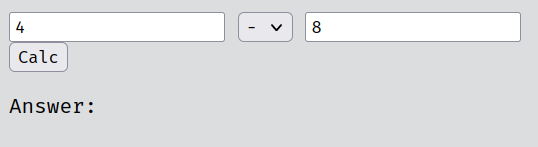

# Basic Calculator

### Output:

- A basic calculator with 2 input fields
- A drop down for choosing operation
- A button to execute

>Initial state: <br>


> sample input: <br>


> when button is pressed <br>


### Src Code
```php
<html>

<head>
  <title>Title</title>
</head>

<body>
    <form>
        <input type="text" name="num1" placeholder="input here">

        <select name="operation">
            <option></option>
            <option>+</option>
            <option>-</option>
            <option>*</option>
            <option>/</option>
        </select>

        <input type="text" name="num2" placeholder="input here">

        <br>
        <button type="submit" name="submit" value="submit">Calc</button>
    </form>

    <p>Answer:</p>
    <?php
        if (isset($_GET['submit'])){
            $res = 0;
            $num1 = $_GET['num1'];
            $num2 = $_GET['num2'];
            $op = $_GET['operation'];

            switch($op){
                case "+": $res = $num1 + $num2; break;
                case "-": $res = $num1 - $num2; break;
                case "*": $res = $num1 * $num2; break;
                case "/": $res = $num1 / $num2; break;
                default:
                    $res = "ERROR";
            }

            echo $res;
        }
    ?>
</body>
</html>
```

> use `isset()` to check if an element in a superglobal.