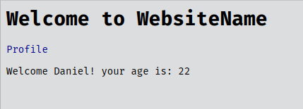

# SESSION

Let's say we have these files:

**index.php**
```html
<html>
<head>
  <title>WebsiteName - Login</title>
</head>
<body>
  <form action="basepage.php" method="post">
    <p>NAME: <input type="text" name="name"></p>
    <p>AGE: <input type="text" name="age"></p>
    <p><input type="submit" name="submit" value="Submit"/></p>
  </form>
</body>
</html>
```
**basepage.php**
```php
<?php
    session_start();
    if($_SERVER['REQUEST_METHOD'] == "POST"){
        $_SESSION['name'] = $_POST['name'];
        $_SESSION['age'] = $_POST['age'];
    }
?>
<html>
<head> <title>WebsiteName</title> </head>
<body>
    <h1>Welcome to WebsiteName</h1>
    <a href="profile.php">Profile</a>
    <p>
    <?php
        echo "Welcome ".$_SESSION['name'].
        "! your age is: ".$_SESSION['age'];
    ?>
    </p>
</body>
</html>
```
**profile.php**
```php
<?php session_start(); ?>
<html>
<head><title>WebsiteName</title></head>
<body>
    <h1>Profile</h1>
    <div> Name: <?php echo $_SESSION['name']; ?> </div>
    <div> Age: <?php echo $_SESSION['age']; ?> </div>

    <a href="basepage.php"> HOME </a>
</body>

</html>
```

|state|screen|
|-|-|
|Upon accessing the server, the `index.html` is loaded. ||
|When we submit the form, `basepage.php` is loaded<br>with an http POST request. The session is started and<br> since a POST request is sent, the `$_SESSION` variables<br> are set equal to the `$_POST` variable counterpart. ||
|if we click the *Profile* hyperlink, it redirects us to<br>`profile.php`.The session is started so the<br> `$_SESSION` data is loaded.||
|If we click the *HOME* hyperlink, it redirects us to<br>`basepage.php`. Since it's not a POST request,<br> the `$_SESSION` data is not reassigned and the page<br> displays the same information.||

> Resource: [w3schools](https://www.w3schools.com/php/php_sessions.asp)
